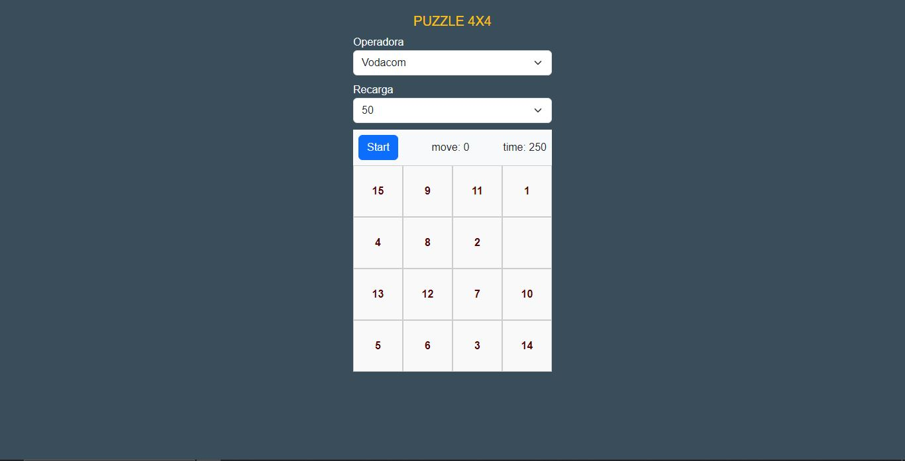
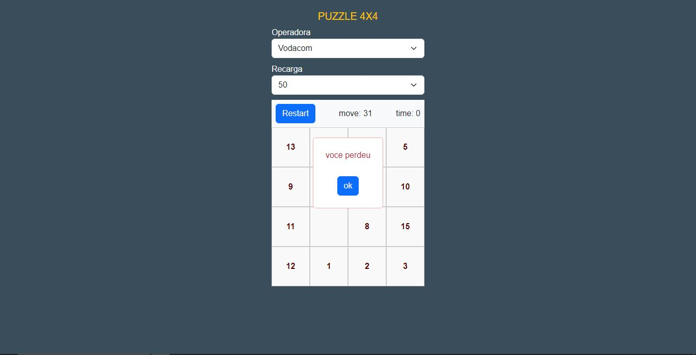

# Puzzle (1-15)

**AVISO: Este projecto é apenas para fins de estudo e avaliacção de empregadores. Se você deseja utilizar este código 
em seus próprios projectos, por favor mencione o autor original.**

Puzzle (1-15) jogo web desenvolvido com JavaScript, HTML, CSS Bootstrap. 
O jogo consiste em organizar os números de 1 a 15 em uma matriz quadrada de forma crescente, movendo os números 
em células adjacentes vazias.

# Tecnologias Utilizadas
JavaScript
HTML
CSS Bootstrap

## Funcionalidades
- Organização dos números de 1 a 15 em ordem crescente.
- Escolha de uma operadora de telefonia móvel.
- Escolha de um valor de recarga.
- Recompensa ao jogador com uma recarga no valor escolhido após vencer o jogo.

## Pré-requisitos

Certifique-se de ter as seguintes dependências instaladas:

- Bootstrap (arquivos CSS e JS)
- Font Awesome (arquivos CSS)
- Biblioteca JavaScript personalizada (js.js)

## Imagns
Aqui estão algumas capturas de tela do puzzle em acção:

*Tela Inicial*

*Apresentação da tela quando o jogador perde*

*Apresentação da tela quando o jogador Vence*